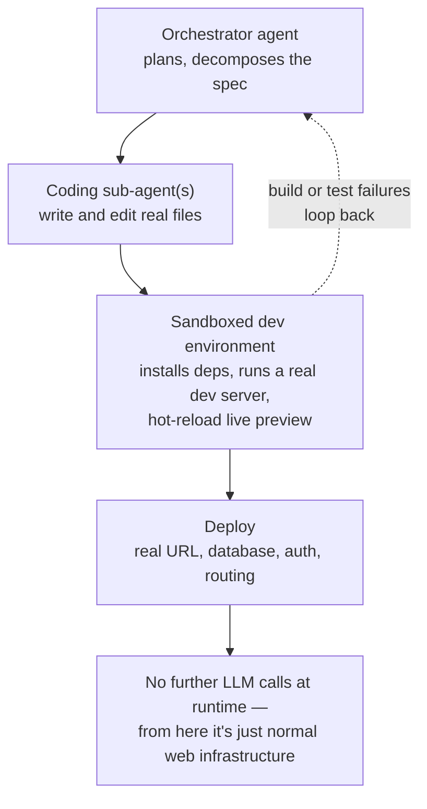

# Agent-as-developer: building a full product with an orchestrator agent

## Why this document exists

Live UI-generation patterns — an agent writing raw HTML/SVG into a sandboxed iframe on every turn — are good for embedded, exploratory canvases inside an otherwise normal application. They are not a sound foundation for an entire UI-heavy product: generated markup doesn't inherit design tokens, output isn't deterministic between runs, the sandbox that keeps it safe also isolates it from the rest of the app, and every screen costs a fresh LLM call at runtime.

There is a fundamentally different pattern for "an orchestrator agent owns the whole product": the agent doesn't render UI live — it **writes and maintains a real, deployed codebase**. This document explains that pattern in depth.

---

## The core shift: artifact, not render

Live-rendering approaches regenerate the UI at request time and throw it away. Agent-as-developer does the opposite: the agent writes files to disk once, and the running application is a normal, compiled, deployed piece of software from that point forward.

No LLM call happens when a user clicks a button in production — that's just React (or whatever the stack is) doing what it always does. The agent's job ends at "code exists and builds"; a conventional runtime takes over from there. This is the single most important distinction from everything in the live-rendering family: **the agent is a developer, not a renderer.**

---

## How it actually runs, mechanically

The concrete engine behind the "sandboxed dev environment" step, in the wild: StackBlitz's Bolt.new runs entirely in the browser. It describes an application, creates files, installs dependencies, and deploys to a preview URL — all inside a web container, with no local setup and no IDE download. That's a real Node.js runtime executing in-browser. The preview is an actual dev server with hot reload, not an LLM re-rendering a document on every keystroke.

---

## The orchestration layer is real, and it's multi-agent

This part should feel familiar if you've built anything with sub-agents before — it's the same shape, applied to software engineering instead of conversation.

Bolt AI's own architecture is described as specialized orchestration layers: an LLM plans tasks, decides which files to edit, and writes code consistently across the project. These agents aren't standalone programs — they're prompt-engineering pipelines that break a request into file-level operations.

**Context management is the hard, non-obvious problem at scale.** A whole codebase doesn't fit in a context window. Production tools chunk and summarize files so they can build applications larger than the raw token window would otherwise allow — this is closer to a retrieval problem than a prompting problem once a project grows past a trivial size.

**For genuinely parallel work, there's a distinct tooling category.** Purpose-built orchestrators exist specifically for running multiple coding agents in parallel across a codebase, rather than one agent working serially through a task list.

**Multi-agent frameworks generalize this beyond coding specifically.** Role-based orchestration — defining agents with specific roles, backstories, and goals, then assembling them into crews that execute sequentially or hierarchically — is a widely adopted pattern for exactly this kind of decomposed, delegated work.

---

## How this maps directly onto an ADK-based setup

You don't need a new framework to try this — ADK already supports the shape:

- A `root_agent` orchestrating `sub_agents`, where one sub-agent is a **coding agent** carrying file-write, bash, and deploy tools.
- Conceptually, this is `ContainerCodeExecutor` extended in two directions: **persistent file output** instead of throwaway `python3 -c` execution, and a **build/test step** that reports pass or fail back to the orchestrator.
- The orchestrator plans and delegates; the coding sub-agent writes real files; a build/test step reports back success or failure; the orchestrator loops if something broke — this is exactly the dashed feedback path in the diagram above.

This pattern is not hypothetical or exotic — it is precisely how tool-using coding assistants operate day to day: a bash tool for execution, a file-write/edit tool for persistent changes, and a delivery step that hands the finished artifact back. A document like this one, iterated across several rounds of edits, is a small live instance of agent-as-developer — every change was a real file mutation, not a re-render.

---

## The 2026 category landscape

The AI-app-building space has split into three distinct jobs. Conflating them is the most common mistake when choosing a tool or deciding what to build yourself.

| Category | Job | Leaders |
|---|---|---|
| **Coding agents** | Edit code in a repo you already own | Cursor, Claude Code — both offer parallel sessions, inline edits, terminal access, and deep integration with an existing workflow |
| **Product agents** | Compile a spec into a deployed app, in one step | Remy — compiles a plain-language spec into a native full stack (backend, database, auth, frontend, deployment), with the spec staying the source of truth as underlying models improve |
| **Prototyping platforms** | Generate a frontend, then iterate by re-prompting | Lovable, Bolt, Replit Agent, v0 — all ship fast, polished frontends, typically with backend functionality assembled from third-party services |

The category boundary that matters most for "should this be the foundation of my product": full product agents don't just write code — they own the build, the database, authentication, payments, hosting, and the custom domain. The output is a running production app, not a folder of files waiting to be wired up.

The chain worth internalizing as the actual production pattern rather than a hypothetical: **the agent writes the code; a builder/deploy layer ships and runs the result.** That two-step chain — generation, then a separate ownership/runtime layer — is what makes this approach scale where live-rendering doesn't.

---

## What this means for the decision

If the goal is genuinely "an orchestrator agent that owns a full UI-heavy product," this is the path — not live component rendering, not a declarative catalog bound to a fixed schema.

**The honest tradeoff, build-your-own vs. adopt an existing platform:**

- Existing product agents and app builders have already solved the hard infrastructure problems — sandboxed containers, deploy pipelines, database/auth scaffolding — that would otherwise be weeks of work before an orchestrator ever writes a line of application code.
- Building this yourself on ADK makes sense when the orchestrator's *decisions* need to be deeply integrated with other agent workflows already in place — not when the actual unsolved problem is "how do I run a dev server in a sandbox."
- A practical middle path: use an existing product agent or coding agent as the "coding sub-agent" tool inside a larger ADK orchestration — delegating the file-writing and deployment mechanics to mature infrastructure, while keeping the higher-level planning and multi-agent coordination in your own orchestrator.

---

*Reference notes reflect the AI app-building and agent-orchestration landscape as documented in mid-2026. This is a fast-moving space — tool names, categories, and capabilities should be re-verified before making architecture decisions.*
